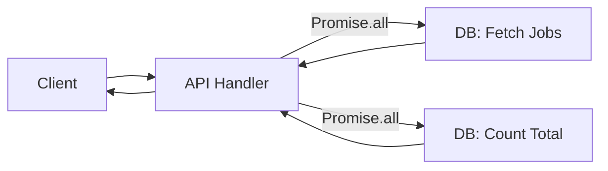

# Jobs API Endpoint Documentation

**Path**: `server/api/jobs/index.get.ts`

## Overview

This endpoint is responsible for fetching a paginated list of job postings. It supports complex filtering across relationships (many-to-many and one-to-many), sorting, and metadata calculation for pagination.

## Request Flow

The endpoint executes two database queries in parallel using `Promise.all` to ensure optimal performance: one for the actual data and one for the total count (needed for pagination UI).



## Filtering Logic

The filtering system handles two types of relationships:

1.  **Direct Relations (One-to-Many)**: e.g., `roleId`, `experienceLevelId`.
2.  **Join Tables (Many-to-Many)**: e.g., `locations`, `tags`, `benefits`.

### Many-to-Many Strategy (Subqueries)

To filter jobs by location (where a job can have multiple locations), we use a subquery strategy. We don't join the tables in the main query to avoid row duplication issues during counting/limiting. Instead, we select IDs of jobs that match the criteria.

**Concept Visualization:**

```mermaid
graph LR
    Input[Filter: "Remote"] --> Locs
    
    subgraph Locs [Locations Table]
        L1[1: London]
        L2[2: Remote]
        style L2 fill:#bbf,stroke:#333,stroke-width:2px
    end
    
    Locs -.-> |ID: 2| JL
    
    subgraph JL [Jobs_Locations Table]
        JL1[Job A -> 1]
        JL2[Job A -> 2]
        JL3[Job B -> 1]
        style JL2 fill:#bbf,stroke:#333,stroke-width:2px
    end
    
    JL -.-> |Job ID: A| Jobs
    
    subgraph Jobs [Jobs Table]
        JA[Job A]
        JB[Job B]
        style JA fill:#bbf,stroke:#333,stroke-width:2px
    end
```

## Usage

### Query Parameters

| Parameter | Type | Description | Example |
| :--- | :--- | :--- | :--- |
| `page` | `number` | The current page number (1-based). Defaults to `1`. | `1` |
| `limit` | `number` | Items per page (Max 100). Defaults to `20`. | `20` |
| `locations` | `string` | Comma-separated list of location slugs. | `remote,london` |
| `roles` | `string` | Comma-separated list of role slugs. | `frontend,backend` |
| `tags` | `string` | Comma-separated list of tag slugs. | `react,typescript` |
| `benefits` | `string` | Comma-separated list of benefit slugs. | `health-insurance,401k` |
| `experienceLevels` | `string` | Comma-separated slugs. | `senior,mid` |

### Code Structure

1.  **Input Parsing**: Extract and sanitize query params. Strictly validates numeric inputs and filters empty values from lists.
2.  **Where Clause Builder**:
    *   Iterate through provided filters.
    *   For each filter present, construct a Drizzle `inArray` check.
    *   Push to `whereConditions` array.
3.  **Data Fetching**:
    *   `Promise.all` executes the Data Query and Count Query simultaneously.
    *   **Data Query**: Uses `db.query.jobs.findMany` with `with: { ... }` to auto-populate relations.
    *   **Count Query**: Uses raw SQL `count(*)` with the same `where` clause.
4.  **Response**: Formats data into standard `data` / `meta` envelope.